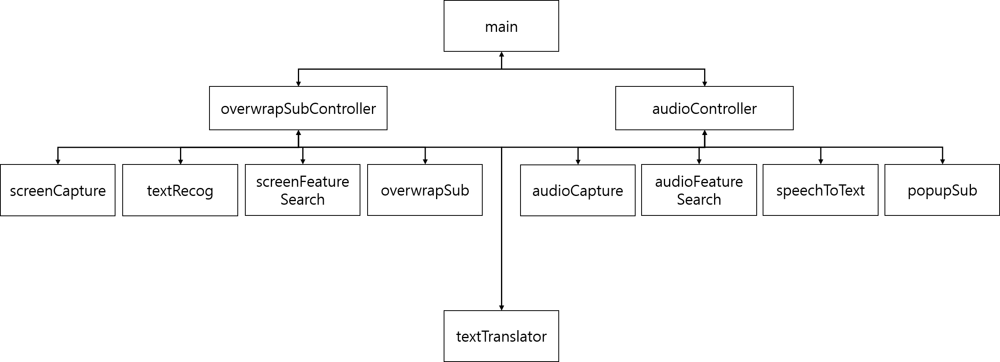

# 소프트웨어 구조 설계서 (ADS)

## 1. 모듈 기능 설계

| 모듈                     | 역할                                                                                   |
|--------------------------|----------------------------------------------------------------------------------------|
| main.py                  | Screen Translator와 Audio Subtitles기능을 On/Off 할 수 있는 GUI 제공                   |
| overwrapSubController.py | Screen Translator기능을 제어하는 GUI 제공                                              |
| overwrapSub.py           | 화면 위에 투명한 배경으로 정보를 출력하는 GUI 제공 Screen Translator기능의 결과를 출력 |
| screenCapture.py         | 화면 캡쳐 기능 수행                                                                    |
| textRecog.py             | 이미지 속 글자 인식 기능 수행                                                          |
| textTranslator.py        | 텍스트 번역 기능 수행                                                                  |
| screenFeatureSearch.py   | Screen Translator기능에서 사람이 이미 번역한 데이터를 탐색하는 기능 수행               |
| audioController.py       | Audio Subtitles기능을 제어하는 GUI 제공                                                |
| popupSub.py              | 화면에 자막을 출력하는 GUI 제공 Audio Subtitles기능의 결과를 출력                      |
| audioCapture.py          | 소리 실시간 녹음 및 처리 기능 수행                                                     |
| audioFeatureSearch.py    | 소리 데이터를 통한 자막 인식 기능 수행                                                 |
| speechToText.py          | 음성 데이터 실시간 녹음 및 음성 인식 기능 수행                                         |
| TabWidget.py             | 설정 윈도우의 Tab위젯 클래스 제공                                                      |
| settingWindow.py         | 설정 윈도우 GUI 클래스 제공                                                            |
| settingManager.py        | 설정 값들을 관리하는 클래스 제공                                                       |

## 2. 각 모듈별 클래스 기능 설계

* main.py

| 클래스        | 역할                                               |
|---------------|----------------------------------------------------|
| ToggleButton  | 각 기능을 Toggle하는 PyQt5 버튼 클래스             |
| ItemContainer | 각 기능에 대한 메뉴를 이루는 PyQt5 레이아웃 클래스 |
| Langtopia     | 각 기능의 On/Off를 GUI로 제공하는 메인 화면        |

* overwrapSubController.py

| 클래스                | 역할                                         |
|-----------------------|----------------------------------------------|
| OverwrapSubController | Screen Translator 기능을 제어하는 GUI 클래스 |

* overwrapSub.py

| 클래스      | 역할                                                        |
|-------------|-------------------------------------------------------------|
| OverwrapSub | 화면 위에 투명한 배경으로 번역된 정보를 출력하는 GUI 클래스 |

* screenCapture.py

| 클래스        | 역할                           |
|---------------|--------------------------------|
| ScreenCapture | Screen capture 수행하는 클래스 |

* textRecog.py

| 클래스    | 역할                                   |
|-----------|----------------------------------------|
| TextRecog | 이미지로 부터 텍스트를 인식하는 클래스 |

* textTranslator.py

| 클래스         | 역할                          |
|----------------|-------------------------------|
| TextTranslator | 텍스트 번역을 수행하는 클래스 |

* screenFeatureSearch.py

| 클래스              | 역할                                                                                                                       |
|---------------------|----------------------------------------------------------------------------------------------------------------------------|
| ScreenFeatureSearch | Screen Translator기능에서 인식한 문장에 대해 사람이 번역한 데이터가 있는 문장인지 파악하고 가져오는 기능을 수행하는 클래스 |

* audioController.py

| 클래스                  | 역할                                                                                          |
|-------------------------|-----------------------------------------------------------------------------------------------|
| AudioCaptureThread      | Audio Subtitles기능의 자막 인식 기능을 수행하기 위한 소리 캡쳐 기능을 수행하는 QThread 클래스 |
| SpeechRecognitionThread | Audio Subtitles기능의 음성 인식 기능을 수행하기 위한 음성 캡쳐 기능을 수행하는 QThread 클래스 |
| AudioSubController      | Audio Subtitles기능을 제어하는 GUI 클래스                                                     |

* popupSub.py

| 클래스   | 역할                                                                  |
|----------|-----------------------------------------------------------------------|
| PopupSub | Audio Subtitles기능의 결과를 출력하기 위한 자막을 출력하는 GUI 클래스 |

* audioCapture.py

| 클래스       | 역할                                                                                     |
|--------------|------------------------------------------------------------------------------------------|
| AudioCapture | Audio Subtitles기능의 자막 인식을 위한 소리 데이터 실시간 캡쳐 및 처리를 수행하는 클래스 |

* audioFeatureSearch.py

| 클래스             | 역할                                                                                              |
|--------------------|---------------------------------------------------------------------------------------------------|
| AudioFeatureSearch | Audio Subtitles기능에서 자막 인식 기능을 위한 음성 데이터를 통한 자막 인식 기능을 수행하는 클래스 |

* speechToText.py

| 클래스       | 역할                                                                                                     |
|--------------|----------------------------------------------------------------------------------------------------------|
| SpeechToText | Audio Subtitles기능에서 음성 인식 기능을 수행하기 위한 음성 데이터 실시간 캡쳐 및 처리를 수행하는 클래스 |

* TabWidget.py

| 클래스    | 역할                                                                                           |
|-----------|------------------------------------------------------------------------------------------------|
| TabBar    | QTabBar를 상속받아 tab bar가 가로로 놓일 수 있도록 하는 클래스                                 |
| TabWidget | QTabWidget를 상속받아 TabWidget의 탭이 왼쪽에 놓이는 동시에 TabBar를 tab bar로 설정하는 클래스 |

* settingWindow.py

| 클래스              | 역할                                                                    |
|---------------------|-------------------------------------------------------------------------|
| SettingScreen       | 스크린 번역 화면의 폰트 색, 배경 색, 선택 색을 설정하는 GUI 제공 클래스 |
| SettingAudio        | 오디오 자막의 자막의 폰트 색, 배경 색을 설정하는 GUI 제공 클래스        |
| SettingSubsManager  | 자막 캡슐 삭제/추가 기능 제공하는 GUI 제공 클래스                       |
| SettingTransManager | 번역 캡슐 삭제/추가 기능 제공하는 GUI 제공 클래스                       |
| SettingWindow       | 설정 화면 GUI 제공 클래스                                               |

* settingManager.py

| 클래스         | 역할                                      |
|----------------|-------------------------------------------|
| SettingManager | 폰트 색, 배경 색 등 설정 내용 관리 클래스 |

## 3. 각 모듈간 관계
다음은 설정 관련 모듈을 제외한 모듈들의 관계를 나타낸다.

사용자는 `main`, `overwrapSubController`, `audioController`와 상호작용 한다.
