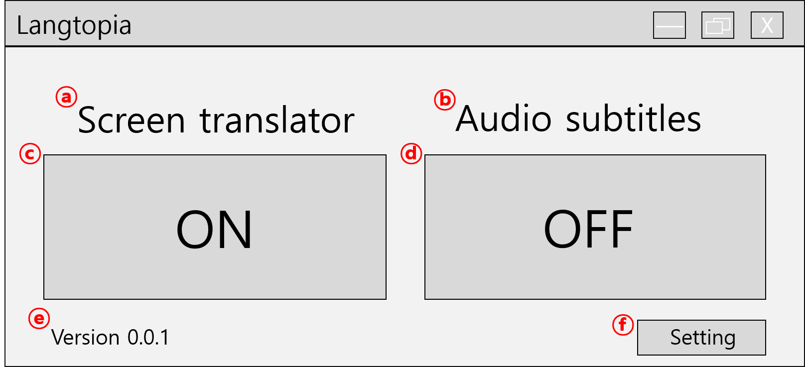

# 요구사항명세서 (SRS)

## 1. 기능적 요구사항
### 1.1. Screen Translator
Screen Translator는 컴퓨터 화면에 나타나는 글자들을 인식 및 번역하여 보여주는 기능을 수행한다.

#### 1.1.1. 스크린 화면 데이터 가져오기
* 컴퓨터 화면 데이터는 이미지 형태로 수집한다.
* 컴퓨터 화면 이미지는 `pyautogui` 모듈을 활용한다.

#### 1.1.2. 글자 인식하기
* 글자 인식은 이미지에서 글자를 인식하는 것으로 한다.
* `pytesseract` 모듈을 활용하여 각 글자와 위치 및 크기를 인식한다.
* 단어 단위로 인식된 상태에서 각 단어의 위치 및 크기를 기준으로 동일한 문단을 인식하도록 한다.

#### 1.1.3. 텍스트 번역
* `googletrans` 모듈을 활용하여 주어진 문자를 번역한다.

#### 1.1.4. 더 나은 번역 제공
* 기계번역이 아닌 사람이 번역한 내용이 존재하면 해당 내용을 출력한다.
* 번역해야 할 문자열이 주어지면 이미 번역된 문장인지 `hash-map` 자료구조를 이용하여 확인한다.

#### 1.1.5. 번역 결과 제공
* 컴퓨터 화면에 있는 글자들을 인식 및 번역한 결과를 출력한다.
* 인식된 글자 위치를 보기 좋게 표시하고 마우스를 올리면 번역된 텍스트가 나타나는 투명한 윈도우를 통해 번역 결과를 출력한다.

### 1.2. Audio Subtitles
Audio Subtitles는 컴퓨터에서 출력되는 소리 및 음성에 대한 자막을 제공해 주는 기능을 수행한다.

Audio Subtitles는 다음 두 가지 기능을 제공한다.
* 자막 인식: 특정 길이의 소리를 탐지하여 해당 소리에 맞는 자막을 재생한다.
* 음성 인식: 음성 감지를 통해 실시간으로 음성을 텍스트로 변환 및 번역한다.

이때, 두 기능 모두 출력을 입력으로 받아야 하지만 일반적인 방법으로 소리 출력장치의 출력을 입력장치의 입력으로 받을 수 없기 때문에, 출력장치의 출력을 받아 입력장치 및 스피커 출력으로 흐름을 나누어 주는 가상 오디오 케이블(Virtual Audio Cable)이 필요하다. 이를 위해 **Voicemeeter** 라는 3rd-party 프로그램을 사용했다.

#### 1.2.1. 자막 인식
##### 1.2.1.1. 소리 데이터 가져오기
* `pyaudio` 모듈을 사용하여 실시간으로 일정 단위씩 음성 데이터를 처리한다.
* 고정된 일정 길이의 소리를 인식대상으로 하기 때문에 `queue` 자료구조를 이용하여 일정 길이로 소리 데이터를 갱신한다.

##### 1.2.1.2. 소리 탐지
* 길이가 n인 소리 데이터를 n차원 벡터로 처리하여 n차원 공간의 한 점으로 치부한다.
* 인식 대상 소리 데이터 중 유클리디안 거리를 기준으로 가장 가까이 위치한 데이터를 탐색한다.
* 가장 가까이 위치한 데이터와의 거리가 해당 데이터에 정해진 threshold보다 작다면 해당 데이터 소리를 탐지한 것으로 한다.
* 더 정확한 결과를 위해서는 FFT를 통해 구한 Spectrogram을 비교해야 한다.
    * 해당 기능은 달성 하려는 목적에 비해 복잡한 과정이므로 생략하도록 한다.

##### 1.2.1.3. 자막 재생
* 인식된 소리 데이터에 해당 하는 자막 데이터를 가져와 출력한다.
* 자막 데이터에는 timestamp와 해당 timestamp에 출력해야 하는 문자열을 각각의 쌍으로 가지고 있는 리스트로 이루어진다.

#### 1.2.2. 음성 인식
##### 1.2.2.1. 음성 데이터 가져오기
* `SpeechRecognition` 모듈에 존재하는 `Microphone` 클래스를 이용하여 3초 단위의 컴퓨터 소리 출력 녹음 데이터를 실시간으로 가져온다.

##### 1.2.2.2. 음성 인식하기
* `SpeechRecognition` 모듈에 존재하는 `pocketsphinx` 모듈을 활용한 음성 인식을 이용한다.
* 음성 인식에 시간이 소요되어 음성을 놓이는 경우가 발생하지 않도록 한다.

##### 1.2.2.3. 인식된 텍스트 번역
* `1.1.3.`과 마찬가지로 `googletrans` 모듈을 활용하여 주어진 문자를 번역한다.

##### 1.2.2.4. 결과 출력
* 인식된 텍스트와 번역 결과를 자막의 형태로 출력한다.

## 2. 사용자 인터페이스 요구사항
### 2.1. Main 화면

* `ⓐ`: QLabel, 아래 버튼이 Screen Translator를 수행하는 버튼임을 명시한다.
* `ⓑ`: QLabel, 아래 버튼이 Audio subtitles를 수행하는 버튼임을 명시한다.
* `ⓒ`: QToolButton, 토글 버튼으로써 버튼이 눌려있을 때 Screen Translator 컨트롤러 화면을 띄운다.
* `ⓓ`: QToolButton, 토글 버튼으로써 버튼이 눌려있을 때 Audio Subtitles 컨트롤러 화면을 띄운다.
* `ⓔ`: QLabel, 버전 정보
* `ⓕ`: QToolButton, 설정 창으로 넘어가는 버튼

### 2.2. Screen Translator
#### 2.2.1. Screen Translator 컨트롤러 화면

#### 2.2.2. 번역 결과 출력 화면

### 2.3. Audio Subtitles
#### 2.3.1. Audio Subtitles 컨트롤러 화면

#### 2.3.2. 자막 출력 화면

## 3. 비기능적 요구사항
### 3.1. 개발 언어 및 사용할 외부 모듈 및 패키지
* 개발 언어: `python 3.7`
* 외부 모듈 및 패키지:
    * `PyQt5`: GUI 구현
    * `pyautogui`: screen capture 구현
    * `pytesseract`: 이미지로 부터 글자 인식
    * `googletrans`: 구글 번역 open API
    * `pyaudio`: 소리 데이터 capture
    * `SpeechRecognition`: 음성 데이터 capture 및 처리
    * `pocketsphinx`: 음성 인식
    * `numpy`: 데이터 처리
    * `scipy`: `k-d tree` 자료구조 이용

### 3.2. Virtual Audio Cable
출력 장치의 출력 오디오 데이터를 얻기 위해서는 출력 장치의 오디오 출력을 스피커 장치 출력(사용자도 소리를 들을 수 있도록 하기 위함) 및 입력 장치의 입력(오디오 데이터를 얻기 위함)으로 흐름을 나누어 주어야 한다.

이를 위해 Virtual Audio Cable 기능을 제공하는 3rd-party 프로그램이 있어야 한다. 이는 [Voicemeeter](https://www.vb-audio.com/Voicemeeter/) 를 사용했다.

### 3.3. Feature Searching 시간 복잡도
#### 3.3.1. 소리 인식 복잡도

자막 인식 기능을 제공하기 위해 길이 n의 소리 데이터 벡터를 이미 존재하는 m개의 점과 비교해야 한다.

가장 naive한 방법은 O(nm)이 들어 m이 많을 경우 비효율적이다.

따라서 `k-d tree` 자료구조를 이용하여 평균 O(log n)의 조금 효율적인 시간에 찾도록 한다.

만약 소리 데이터가 굉장히 많아지면 LSH (Locality Sensitive Hashing) 등의 best-effort 기법을 활용하여 효율적인 시간에 소리를 인식할 수 있을 것이다. 해당 기능은 구현하려는 목적에 비해 복잡하므로 생략한다.

#### 3.3.2. 이미 번역한 글자 인식 복잡도

상수시간 내에 인식하기 위해 `hashed map` 자료구조를 이용한다.
